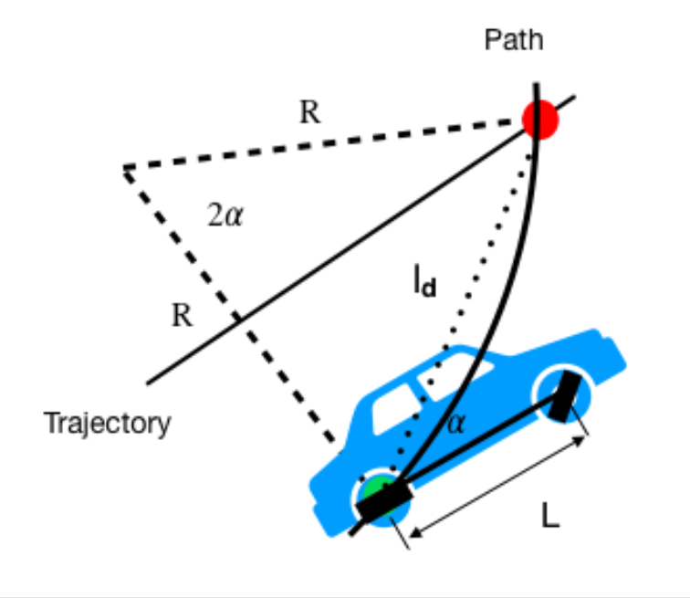

# Pure Pursuit Steering Control  
### ROS2 – Simulink Integrated Control Architecture 

This document describes the **Pure Pursuit–based steering control module** used in our qualification-stage autonomous driving system.  
The focus is on **how the controller was structured, integrated, and utilized** within the ROS2–Simulink pipeline, rather than on vehicle dynamics or real-world experiments.

---

## 1. Overall System Architecture

The qualification driving system was designed with a **clear separation of responsibilities** between path handling and control computation, ensuring modularity, explainability, and reproducibility.

### Role Assignment

- **ROS2 (Python / C++)**
  - Global path and waypoint management  
  - Target point generation via the Helper node  

- **MATLAB Simulink**
  - Steering angle computation based on Pure Pursuit  
  - Structured and visualized control logic  

- **Simulink Code Generation**
  - Conversion of Simulink models into ROS2-native nodes  
  - Real-time data exchange between MATLAB and ROS2  

This architecture allows the control logic to remain fully inside Simulink while being **seamlessly integrated as a native ROS2 node**.

---

## 2. Pure Pursuit Control Logic

Pure Pursuit is a **geometric path-following algorithm** that computes steering commands by tracking a target point located ahead on the reference path.

In this project, the Pure Pursuit controller operates as follows:

1. Receive current vehicle pose and target point from the Helper node  
2. Compute the relative position of the target point in the vehicle coordinate frame  
3. Calculate path curvature using the Look-Ahead Distance  
4. Convert curvature into a steering command and publish it via ROS2  

The geometric relationship used in this controller is illustrated below.

<table>
  <tr>
       
      <b>Pure Pursuit Algorithm</b>
    </td>

---

### Mathematical Formulation

Let:

- $l_d$ : Look-Ahead Distance  
- $\alpha$ : Angle between vehicle heading and target point  
- $R$ : Radius of curvature  

From the geometric relationship,

$$
\frac{l_d}{\sin(2\alpha)} = \frac{R}{\sin\left(\frac{\pi}{2} - \alpha\right)}
$$

which simplifies to:

$$
\frac{l_d}{\sin(\alpha)} = 2R
$$

Thus, the curvature $k$ is:

$$
k = \frac{1}{R} = \frac{2\sin(\alpha)}{l_d}
$$

Let $L$ be the wheelbase and $\delta$ the steering angle.  
Using the bicycle model relationship:

$$
R = \frac{L}{\tan(\delta)}
$$

The final steering command is computed as:

$$
\delta = \arctan\left(\frac{2L\sin(\alpha)}{l_d}\right)
$$

The controller directly computes the steering angle using this formulation
based on the target point and Look-Ahead Distance provided by the Helper node.

---

## 3. ROS2–Simulink Integration via Code Generation

Instead of limiting the controller to MATLAB-only simulation,  
**Simulink Code Generation** was used to compile the Pure Pursuit controller into a ROS2 node.

This approach provides several advantages:

- Direct MATLAB–ROS2 communication without external bridges  
- Clear separation between high-level logic (Python) and control computation  
- Improved readability and reproducibility for qualification submission  

The Simulink model uses ROS2 Subscriber and Publisher blocks to directly interface with ROS2 topics and behaves identically to other ROS2 nodes at runtime.

---

## 4. Data Flow Between Helper and Simulink

The table below summarizes the **actual data interface** used between the Helper node and the Simulink-based controller during the qualification stage.

| Category | Sender | ROS2 Topic / Data | Description | Processing in Simulink |
|---|---|---|---|---|
| Vehicle Pose | Helper | `/current_pose` (x, y, yaw) | Current pose in SLAM frame | Coordinate transformation |
| Target Point | Helper | `/target_point` (x, y) | Waypoint selected by Look-Ahead Distance | Relative position computation |
| Look-Ahead Distance | Helper | `/lookahead_dist` (float) | Adaptive look-ahead value | Curvature calculation |
| Steering Command | Simulink | `/steering_cmd` (float) | Pure Pursuit steering output | Forwarded to downstream modules |

With this structure:

- **Path and waypoint logic** remain in ROS2  
- **Control equations and computation** are handled exclusively in Simulink  

Only essential data are exchanged between modules.

---

## 5. Performance in Qualification Environment

In the qualification simulation environment, the Pure Pursuit–based control structure demonstrated:

- Stable path-following across varying track geometries  
- Robustness to changes in waypoint density and update rates  
- Rapid iteration and tuning enabled by Simulink-based control logic  

By deploying the controller as an independent ROS2 node, the overall system achieved a **clear, explainable, and modular control pipeline** suitable for qualification evaluation.

---

## 6. Summary

This Pure Pursuit steering control implementation represents a **practical, qualification-ready control architecture**, characterized by:

- Effective use of Pure Pursuit for geometric path following  
- Native ROS2 integration via Simulink Code Generation  
- Clean separation of responsibilities between Helper and control modules  

The resulting pipeline satisfies the qualification-stage requirements for  
**clarity, reproducibility, and explainability of control logic**.

---

## Results

The following figure shows the actual steering behavior of the Pure Pursuit controller
in the qualification simulation environment.  
The controller continuously computes steering commands based on the geometric
relationship between the vehicle and the reference path.

<table>
  <tr>
    <td align="center">
       
      <b>Pure Pursuit Steering Control Result</b>
    </td>
  </tr>
  <tr>
    <td align="center">
       
      <b>Simulink-Based Steering Control Structure</b>
    </td>
  </tr>
</table>
As shown in the figure, the controller demonstrates stable path-following performance
while smoothly converging toward the target path. Steering commands are generated
without oscillatory behavior, and the vehicle maintains consistent tracking even
through curved sections of the trajectory.
