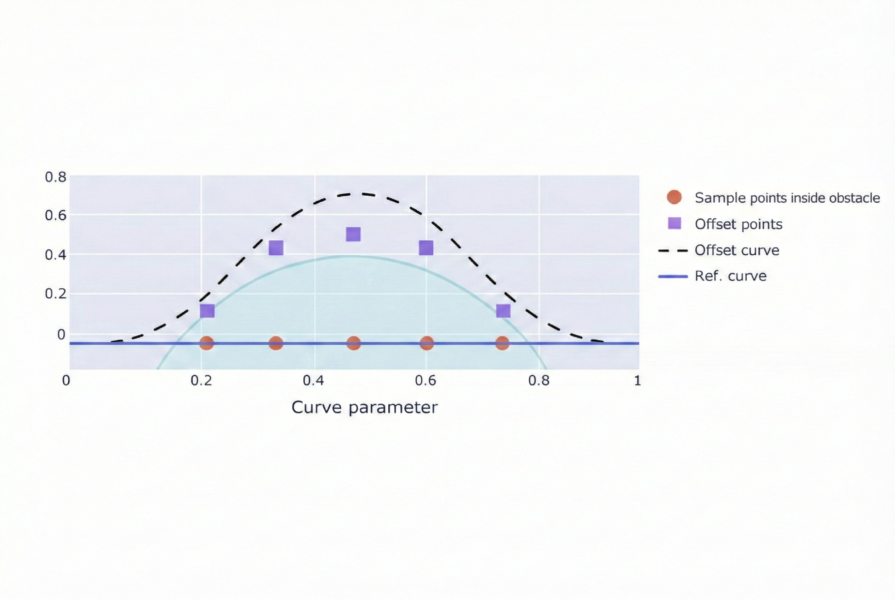

# Obstacle Avoidance Control

This document describes the obstacle avoidance algorithm designed for
simple static and dynamic obstacle scenarios that may occur in the
qualification-stage autonomous driving environment.

The proposed obstacle avoidance strategy prioritizes **stability,
explainability, and practical implementability**, and is intended to be
continuously refined and updated as experimental validation progresses.

---

## 1. Avoidance Trigger Condition

Obstacle avoidance is triggered based on the **relative distance**
between the ego vehicle and a detected obstacle in front.

Using camera and LiDAR sensors, when the distance between the ego vehicle
and a front obstacle (or leading vehicle) falls below a predefined
threshold, the situation is classified as one that **requires an
avoidance maneuver**.

This distance-based triggering logic minimizes unnecessary avoidance
actions and ensures that avoidance is executed only when a potential
collision risk is present.

---

## 2. Obstacle Estimation and Minimum Lateral Offset Calculation

Once avoidance is triggered, LiDAR (or a depth camera, if available) is
used to estimate the **length and spatial extent** of the obstacle.

The following factors are jointly considered:

- Estimated obstacle width
- Ego vehicle width
- Additional safety margin

Based on these factors, the **minimum required lateral offset** is
computed to ensure collision-free passage around the obstacle.
This offset value serves as the key parameter for subsequent path
modification.

---

## 3. Waypoint Offset-Based Avoidance Strategy

Instead of generating an entirely new global path, the proposed method
performs **local modification of the existing reference path**.

In regions where the reference path overlaps with the obstacle, the
corresponding waypoints are shifted laterally by the computed minimum
offset until they no longer intersect with the obstacle region.

This approach allows the system to:

- Preserve continuity of the original reference path
- Apply avoidance only where strictly necessary
- Prevent excessive or unnecessary path deformation

The figure below illustrates the concept of shifting overlapping
waypoints laterally to generate an avoidance path while maintaining
smooth path continuity.

<table>
  <tr>
    <td align="center">
       
      <b>Waypoint Offset-Based Obstacle Avoidance Concept</b>
    </td>
  </tr>
</table>

---

## 4. Curvature-Based Avoidance and Lane Recovery

Based on the laterally shifted waypoints, the vehicle follows an
avoidance path with a **constant curvature** to smoothly bypass the
obstacle.

The avoidance maneuver follows these principles:

- Constant-curvature motion to avoid abrupt steering changes
- Minimal lateral deviation for stable obstacle clearance
- Natural compatibility with the Pure Pursuit steering controller

After the obstacle is fully passed and no additional obstacles are
detected in the adjacent lane or avoidance region, the vehicle returns
to the original reference path using the **same curvature magnitude**
applied during the avoidance maneuver.

This symmetric curvature strategy ensures steering continuity and
overall driving stability during both avoidance and recovery phases.

---

## 5. Current Implementation Status and Future Work

At the qualification stage, the obstacle avoidance module is implemented
with a **conservative and rule-based structure**.

The current implementation focuses on:

- Reliable distance-based avoidance triggering
- Minimum-offset-based path modification
- Stable integration with the Pure Pursuit steering controller

Future development plans include:

- Validation under diverse obstacle configurations
- Fine-tuning of thresholds and safety margins
- Gradual integration of more advanced decision-making strategies

This document will be continuously updated as implementation and
experimental validation progress.

---

### Internal Summary

> **“Respect the original path, and avoid only as much as necessary.”**

