# Decision & Planning (RRT Global Path + DQN Mission Sequencing)

This document describes our **planning layer** for a closed-track autonomous taxi scenario.
We explicitly separate planning into two layers:

1. **Global Path Generation (Geometry / Drivable Trajectory)**  
   - Generates a continuous global trajectory (waypoints) inside the track corridor using **segment-wise RRT** and **post-processing smoothing**.

2. **Planning & Decision (Mission / Node Visit Order)**  
   - Computes the **optimal route sequence (node visit order)** for Pick-up / Drop-off tasks using a **Deep Q-Network (DQN)** on a directed graph representation.

This separation improves interpretability and integration:
- **RRT** answers: *“Where can the car physically drive (drivable trajectory)?”*  
- **DQN** answers: *“In what order should the car visit mission nodes (task sequencing)?”*  

The outputs are stored as **JSON waypoint segments** and can be loaded by downstream modules
(e.g., **MATLAB/Simulink controllers** or **ROS2 helper nodes**) for real-time execution.

---

## Part A. RRT-Based Global Path Generation

---

## 1. Overview

This project pre-generates a **global driving path** for an autonomous vehicle operating in a **closed-track environment** using the **RRT (Rapidly-exploring Random Tree)** algorithm.

Because the taxi scenario was conducted on a competition-grade closed track, pre-generation of the entire path was practically feasible.  
Although the conventional RRT algorithm is effective for path exploration, its **random sampling** nature introduces the following limitations:

- The result differs each time the algorithm is executed, and the generated path often lacks **continuity**.  
- Since no cost function is considered, RRT does not guarantee an **optimal (shortest or smoothest)** path.

To overcome these issues, the study defines **Free Space** for each track segment, repeatedly executes RRT in every segment, and then performs **post-processing (smoothing)** to construct a continuous and drivable global path.

In other words, while embracing the stochastic exploration characteristic of RRT, we exploit the repeatability of a closed-track environment to evaluate path quality quantitatively and **pre-construct the most stable and consistent trajectory** before real driving.

---

## 2. Theoretical Background of RRT

The core idea of RRT is to randomly sample a point in the search space, find the nearest node in the existing tree, and extend (steer) the tree from that node toward the sample by a small step Δq.  
Repeating this process rapidly expands the tree throughout the space until it reaches the goal region.

---

### (1) Random Sampling

$$
q_{\text{rand}} \sim U(Q)
$$

A random point \( q_{\text{rand}} \) is sampled within the search space \( Q \).

---

### (2) Nearest-Node Search

$$
q_{\text{near}} = \underset{q_i \in T}{\arg\min}\, \text{dist}(q_i, q_{\text{rand}})
$$

Among all nodes currently in the tree, the one with the smallest distance to \( q_{\text{rand}} \) is selected.  
The distance metric can be Euclidean or any metric suitable for the configuration space.

---

### (3) Tree Extension (Steer Function)

$$
q_{\text{new}} = q_{\text{near}} + 
\frac{(q_{\text{rand}} - q_{\text{near}})}{\|q_{\text{rand}} - q_{\text{near}}\|} \cdot \varepsilon
$$

From \( q_{\text{near}} \), a new point \( q_{\text{new}} \) is created by moving a step \( \varepsilon \) toward \( q_{\text{rand}} \).  
(In other words, one incremental step in the direction of \( q_{\text{rand}} \).)

---

### (4) Collision Check

$$
q_{\text{new}} \in C_{\text{free}}
$$

Verify that \( q_{\text{new}} \) lies within the free configuration space \( C_{\text{free}} \).  
If it violates the corridor boundary, discard \( q_{\text{new}} \).

> Note: The closed track has no internal physical obstacles, but **the drivable corridor boundaries**
> (left/right lane limits) function as constraints that must be respected.  
> Thus, collision checking is implemented as an **in-corridor validity test**.

**Segment-based collision test**

$$
\text{CollisionFree}(q_{\text{near}}, q_{\text{new}}) =
\begin{cases}
\text{True}, & \text{if } (1-s)q_{\text{near}} + s q_{\text{new}} \notin O,\; \forall s \in [0,1] \\
\text{False}, & \text{otherwise}
\end{cases}
$$

- \( O \): invalid region (outside the corridor)  
- If no point on the segment between \( q_{\text{near}} \) and \( q_{\text{new}} \) lies inside \( O \) for all \( s \in [0,1] \), the motion is valid.

---

### (5) Tree Expansion and Node Addition

$$
T = T \cup \{ (q_{\text{near}}, q_{\text{new}}) \}
$$

If valid, add the new node and edge to the tree.

---

## 3. Definition of Free Space and Problem Recognition

### 3.1 Structural Characteristics of the Track

The track has only an **outer boundary**, with no internal physical obstacles.  
While traffic lights and signs exist visually, the interior is essentially an **open empty space**, meaning that an **occupancy-grid representation** cannot accurately describe drivable regions.  
Therefore, a conventional occupancy-based environment model has fundamental limitations for applying RRT.

---

### 3.2 Centerline Extraction via Cartographer SLAM

To overcome this issue, the **centerline coordinates** obtained from **Cartographer-based SLAM** during vehicle driving were used.  
The centerline was laterally expanded by the lane width to generate left and right boundaries, modeling each track segment’s **Free Space** as a **polygonal corridor**.

---

### 3.3 Problems of Whole-Track Free-Space Generation

Initially, RRT was executed by forming a single free-space polygon using the entire track centerline.  
However, the presence of **intersections**, **roundabouts**, and **bi-directional lanes** caused **overlaps and tangling** among free-space polygons.

<p align="center">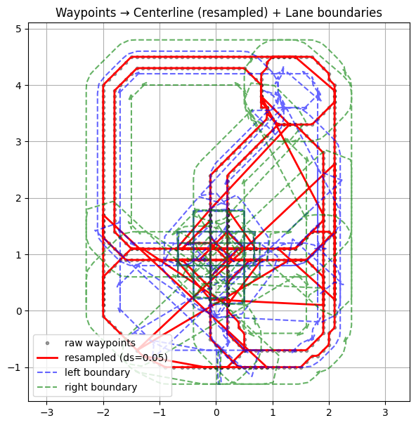</p>

As a result:
- The free-space definition became incomplete.  
- RRT expansion behaved abnormally or extended beyond the valid track boundary.  
- Numerous off-track trajectories were generated.

---

## 4. Segment-wise Free-Space Division and RRT Execution

To resolve these issues, the track was divided into multiple **segments**.  
Each segment consists of a continuous portion of the centerline with a fixed arc length,  
and an **independent free-space corridor** was modeled for each one.

---

### 4.1 Free-Space Modeling Procedure (Pseudo Code)

The following pseudo code summarizes how each segment’s Free Space was modeled using the waypoint data.  
The actual implementation loads waypoint JSON files and processes them sequentially.

Each segment includes the following steps:
1. Load and merge waypoints.  
2. Re-sample by arc length.  
3. Generate left/right lane boundaries using the lane width.  
4. Define the polygonal Free Space.

```python
INPUT: files = sorted(glob("waypoints_*.json"), by natural order)
PARAM: ds=0.05, lane_width=0.4
OUTPUT: segments_free_space = [FreeSpace_i], centerline, left/right boundaries

# 1) Load & stitch
segments = [ load_json_xy(f) for f in files ]
center_raw = stitch(segments)  # remove duplicated endpoints at joins

# 2) Resample (arc-length uniform)
centerline = resample_uniform(center_raw, step=ds)

# 3) Lane boundaries via normal offsets
tangent = normalize(gradient(centerline))
normal  = rotate90(tangent)  # [-t_y, t_x]
left_boundary  = centerline + 0.5 * lane_width * normal
right_boundary = centerline - 0.5 * lane_width * normal

# 4) Segmenting rules
breaks = []
for i from 1 to len(centerline)-2:
    kappa = curvature(centerline, i)
    dpsi  = heading(centerline, i) - heading(centerline, i-1)
    if kappa > κ_thresh OR abs(dpsi) > ψ_thresh OR arc(i) - arc(last_break) > L_max:
        breaks.append(i)

segments_idx = pairwise([0] + breaks + [len(centerline)-1])

# 5) Free space polygons
segments_free_space = []
for (s, e) in segments_idx:
    L = left_boundary[s:e+1]
    R = right_boundary[s:e+1]
    corridor = polygon( concatenate(L, reverse(R)) )
    segments_free_space.append(corridor)
```

### 4.2 Example of Segment Modeling Results

Below are representative examples of **Free-Space modeling results** for selected portions of the track.

<table><tr>
<td>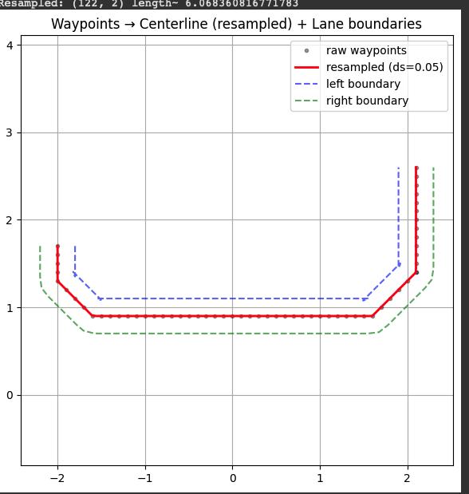</td>
<td>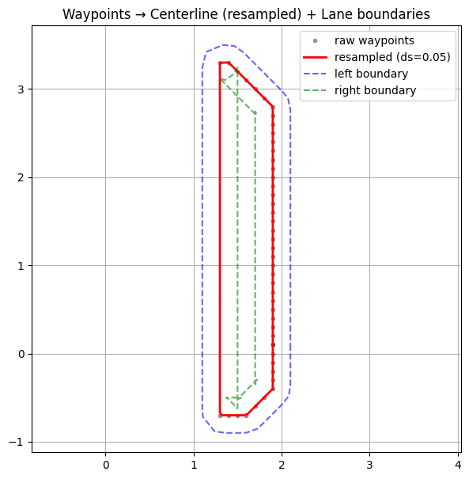</td>
<td></td>
</tr></table>

- The **black line** represents the extracted **centerline**.
- The **blue and green dashed lines** indicate the **left and right lane boundaries**, respectively.

Each segment’s Free Space is modeled as a **polyline-shaped corridor band** derived from the centerline and lane width.
This modeling procedure was applied to all track segments; the figures shown here are representative examples.

For each segment, the **RRT algorithm** was executed independently within the corresponding Free Space corridor to generate a **locally feasible path**.
These segment-level paths were then connected sequentially to produce a **global path** covering the entire track.


## 5. RRT Execution Results and Analysis

### 5.1 Algorithmic Procedure (Pseudo Code)

```text
Algorithm: Rapidly-exploring Random Tree (RRT)

1. Initialize tree T with start node q_start
2. for i = 1..N_max:
     q_rand ← SampleFree(C)                     # random in corridor C
     q_near ← Nearest(T, q_rand)
     q_new  ← Steer(q_near, q_rand, η)
     if EdgeInCorridor(q_near, q_new, C):
         AddNode(T, q_new)
         AddEdge(T, q_near → q_new)
         if ||q_new - q_goal|| ≤ r_goal:
             return Backtrack(T, q_new)
3. return Failure (if goal not reached)

```
## 5.2 RRT Execution Results

<table><tr>
<td></td>
<td></td>
<td></td>
</tr></table>
The figures above visualize **RRT-based path generation** for several different segments.

- **Green area**: drivable corridor  
- **Blue dots and lines**: RRT exploration tree  
- **Red line**: final connected path  

(Target points within each segment were selected manually.)

---

## 5.3 Result Analysis and Limitations

<table><tr>
<td>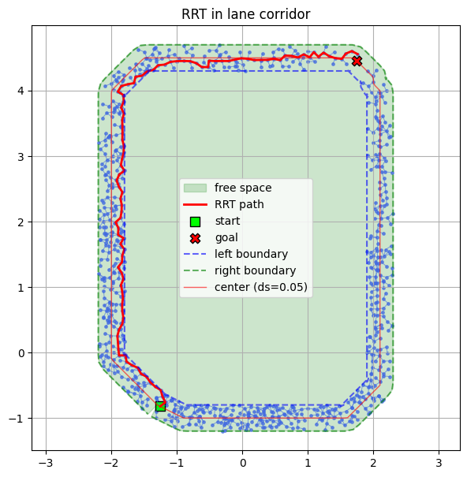</td>
<td>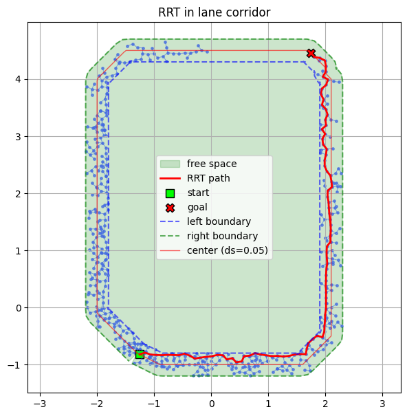</td>
</tr></table>

Through **segment-wise RRT generation**, the algorithm successfully produced feasible paths that reached the goal quickly.  
However, because RRT relies on **random sampling**, multiple runs over the same segment yielded slightly different trajectories.

### Observed Limitations

- Paths were **discontinuous** and included **sharp turns**
- The method does **not guarantee the shortest or optimal path**

Therefore, raw RRT results were **unsuitable for direct vehicle driving**.  
A **post-processing smoothing stage** was required to improve continuity and optimality.

---

# 6. Post-Processing (Smoothing) and Final Path Generation

## 6.1 Elastic-Band-Based Path Smoothing

Elastic-band smoothing treats the path as a **physical spring model**.  
By combining the effects of:

- path length (tension)
- curvature
- clearance
- centerline attraction

each waypoint is iteratively adjusted to minimize energy and ensure smoothness and clearance.

### Pseudo Code: Elastic-Band Path Smoothing

```text
Algorithm: Path Smoothing
Input : Initial path P (e.g., RRT output)
Output: Smoothed path P_smooth

Repeat until convergence:
  for each waypoint i in P:
    apply tension force
    apply curvature force
    apply clearance force
    apply centerline attraction
    update waypoint position
```

## 6.2 Comparison Before and After Smoothing

| Before | After |
|---|---|
| 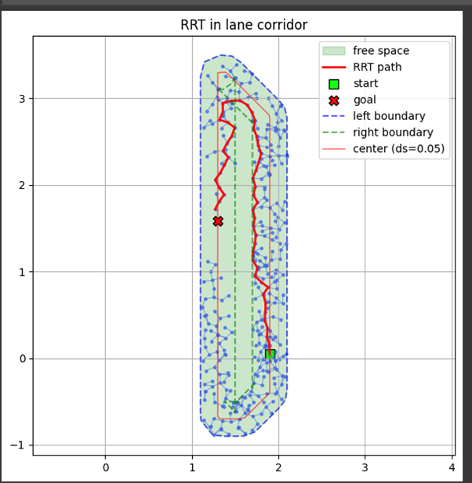 | 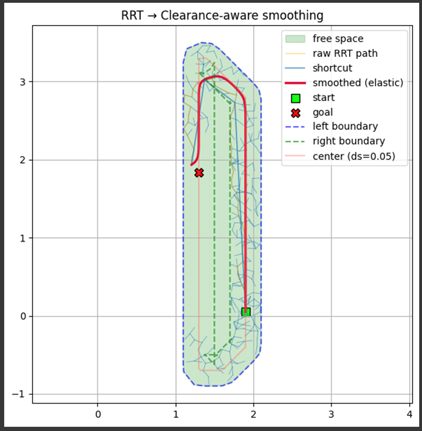 |

- **Left**: Raw RRT result (discontinuous path)  
- **Right**: Clearance-aware Elastic-band smoothing result (smooth and drivable path)

After smoothing:

- Curvature variation decreased significantly
- Previously disconnected segments were smoothly connected, ensuring continuity
- In curved regions, the path exhibited natural curvature reflecting vehicle dynamics and lane width
- Minimum clearance from corridor boundaries was preserved
- Total path length was slightly shortened, improving overall efficiency compared to the raw RRT output

---

## 6.3 Global Path Visualization

<p align="center">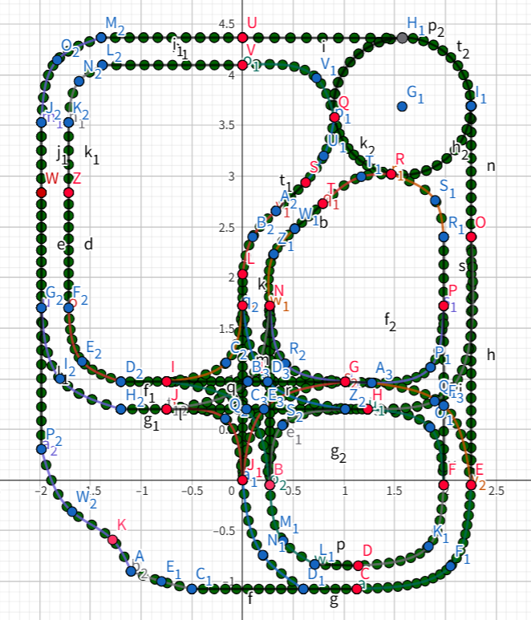</p>

The figure above illustrates the **global path visualization** across the entire track.

- Center coordinates of all RRT-based segment paths were extracted
- Splines and straight segments were connected using **GeoGebra**
- Curvature variation and trajectory continuity became intuitively observable

This visualization clearly demonstrates the **structural shape** and **drivable regions** of the final global path.

The resulting trajectory combines:

- the **exploratory robustness** of RRT  
- the **smooth optimality** of the Elastic-band method  

forming a global path that is both **feasible** and **realistic** for real-world vehicle driving.

---

# 7. Conclusion and Significance

This research considered both:

- the **structural constraints** of the track  
- the **exploratory nature** of RRT  

By integrating:

- segment-wise Free-Space division  
- repetitive RRT-based exploration  
- post-processing correction through smoothing  

a complete **global driving path** was pre-constructed.

The proposed method is meaningful in that it:

- pre-generates a drivable path for the entire track in **data form**
- can be directly utilized by higher-level planning and control modules
- served as input to a subsequent **DQN (Deep Q-Network)**-based mission ordering module

Ultimately, this approach demonstrates the potential of linking:

- **sampling-based global planning**
- **learning-based decision-making modules**

thereby improving both the **efficiency** and **practicality** of autonomous path planning.


## Part B. Planning and Decision (DQN): Optimal Node Visit Order

This section derives the **optimal route sequence (node visit order)** inside a closed-loop track using a **Deep Q-Network (DQN)** approach.  
The algorithm was developed for an autonomous taxi scenario, where the vehicle must sequentially visit predefined **Pickup** and **Drop-off** points.

---

## 1. Theoretical Background

### 1.1 Q-Function Definition

The **Q-function** defines the expected cumulative reward obtainable from a given state–action pair \((s, a)\):

$$
Q^*(s, a) = \max_\pi \, \mathbb{E} \left[ \sum_{t=0}^{\infty} \gamma^t r_t \; \middle| \; s_0 = s, \, a_0 = a, \, \pi \right]
$$

---

### 1.2 Q-Learning Update Rule

The **Q-learning** algorithm iteratively updates the state–action value to approximate the optimal policy:

$$
Q(s, a) \leftarrow Q(s, a) + \alpha \left[ r + \gamma \max_{a'} Q(s', a') - Q(s, a) \right]
$$

---

### 1.3 Deep Q-Network (DQN) Approximation

To handle high-dimensional state spaces, Q-functions are approximated using neural networks:

$$
Q(s, a; \theta) \approx Q^*(s, a)
$$


Key components:

- **Experience Replay:** Randomized sampling from memory buffer to stabilize learning  
- **Target Network:** Periodic parameter synchronization to prevent divergence  
- **Epsilon-Greedy Policy:** Balances exploration \((\varepsilon)\) and exploitation \((1-\varepsilon)\)

---

### 1.4 Target Q-Value

The target value incorporates the reward and discounted future reward estimate:

$$
\text{target}[a] = r + \gamma \max_{a'} Q(s', a'; \theta^-)
$$

---

### 1.5 Loss Function

The DQN minimizes the mean-squared error between the target network and the current Q-value network:

$$
L(\theta) = \mathbb{E}_{(s, a, r, s') \sim D} 
\left[ \big( r + \gamma \max_{a'} Q(s', a'; \theta^-) - Q(s, a; \theta) \big)^2 \right]
$$

---

## 2. Algorithm Design

### 2.1 Track Environment Modeling

The track is modeled as a **directed graph** with **60 nodes (0–59)**.  
The vehicle starts at node 0, visits several intermediate **Pick-up / Drop-off** nodes sequentially, and returns to the **final hub (node 59)**.  

Each sub-goal is treated as a local objective, and the network learns to complete these goals in order.

---

### 2.2 Reward Function Design

| Condition | Reward / Penalty | Purpose |
|:----------|:----------------:|:--------|
| Reach sub-goal node | +100 | Encourage fast arrival at waypoints |
| Enter loop node (SCC > 1) | −1000 | Suppress cyclic route exploration |
| General movement | −1 | Penalize unnecessary movement |
| Revisit same node | −10 × (visit count) | Prevent redundant routes |
| Branch node (out-degree > 1) | +5 | Encourage route diversity |

At the end of each segment, the agent receives a **+100 reward** for successfully reaching the next **Pick-up / Drop-off** node, driving the policy to learn sequential goal achievement.

---

### 2.3 ε-Greedy Policy

The ε-Greedy exploration rate starts from **ε = 0.5** and decreases linearly toward 0 during training.  
This allows broad exploration in early episodes and convergence to stable exploitation in later stages.

---

### 2.4 Network Architecture and Hyperparameters

| Parameter | Description | Value |
|:----------|:------------|:-----:|
| Structure | 2-layer MLP (Input–Hidden–Output) | — |
| Activation | ReLU | — |
| Loss Function | MSE (Mean Squared Error) | — |
| Optimizer | Gradient Descent | — |
| Learning Rate (α) | — | 0.01 |
| Discount Factor (γ) | — | 0.9 |
| Hidden Units | — | 64 |
| Episodes | — | 5000 |
| Max Steps per Episode | — | 100 |

Fallback mechanism:  
If no valid goal is reached, a **BFS-based shortest path** is applied to guarantee that a valid route is always generated.

---

## 3. Implementation and Results

### 3.1 SimpleDQN Class

The DQN agent was implemented as `SimpleDQN`.  
Each episode consists of iterative learning between the agent and the environment.  

The agent selects actions using the **ε-Greedy policy**, updates parameters via **backpropagation**, and applies learned weights for **greedy inference after training**.

---

### 3.2 Scenario 1 — Single Pick/Drop Case

**Scenario:**  
Start → Pick-up (Node 3) → Drop-off (Node 34) → Return to Hub (Node 59)

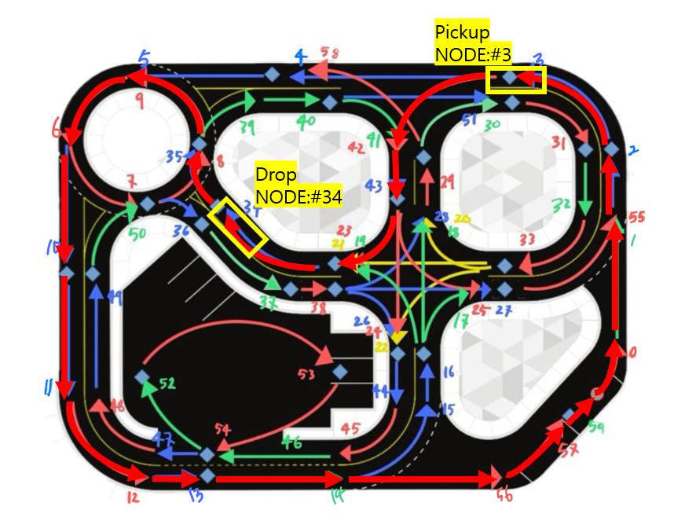

**Result:**  
The DQN accurately visited all assigned nodes sequentially, avoiding reverse driving or redundant paths.  
It demonstrated robust route planning within the complex directed graph structure.

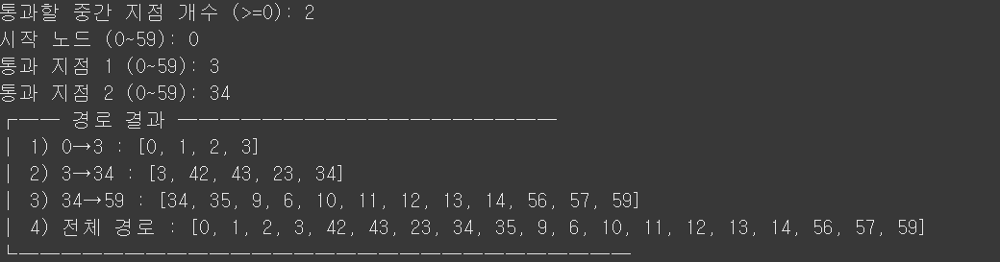

---

### 3.3 Scenario 2 — Multiple Intermediate Stops

**Scenario:**  
Start → 3 → 43 → 49 → 10 → 14 → Return to Start

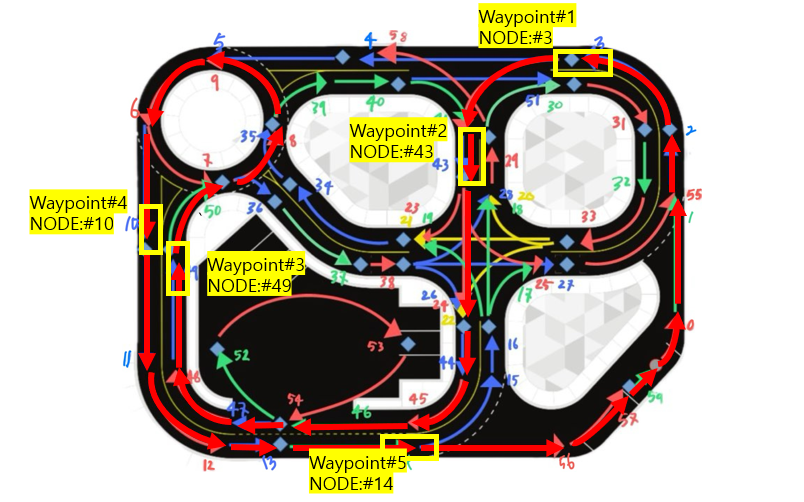

**Result:**  
Even with an increased number of waypoints, DQN maintained consistent and stable route generation.  
It sequentially achieved all sub-goals, validating scalability for more complex multi-stop taxi missions.


---

### 3.4 JSON Storage and Integration

The generated paths were saved as segmented files (`p1`, `p2`, `p3`, …) and also merged into a total integrated path.


This **segment-based structure** allows independent learning and validation of each route segment while maintaining full-path integration.  
The resulting JSON files can be directly loaded into **MATLAB Simulink control modules** or **ROS2 helper nodes** for real-time trajectory tracking.

---

## 4. Conclusion

By applying a **Deep Q-Network (DQN)** for route sequence optimization,  
the model successfully computed the **optimal Pick-up and Drop-off sequence** in a closed-track environment.

The system achieved **stable convergence** without loops or reverse motion.  
Performance remained **consistent** even as the number of waypoints increased.

The DQN-generated paths were **directly usable** in **MATLAB Simulink** and **ROS2 nodes**.  
Pre-calculated routes enabled **real-time mission switching** during competition scenarios.

These results confirm that **DQN-based planning** can serve as a  
**mission-level decision engine**, while **geometric path execution**
is handled by downstream control modules.


