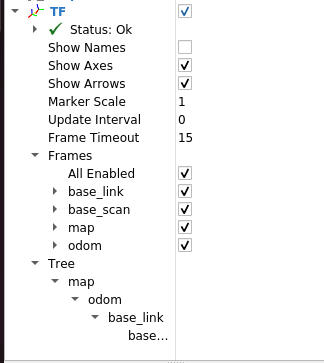
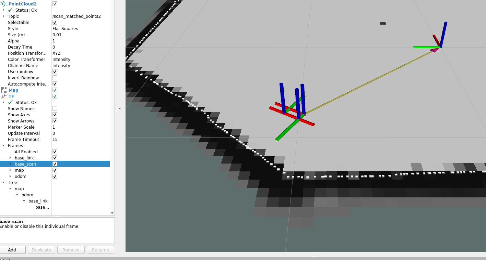
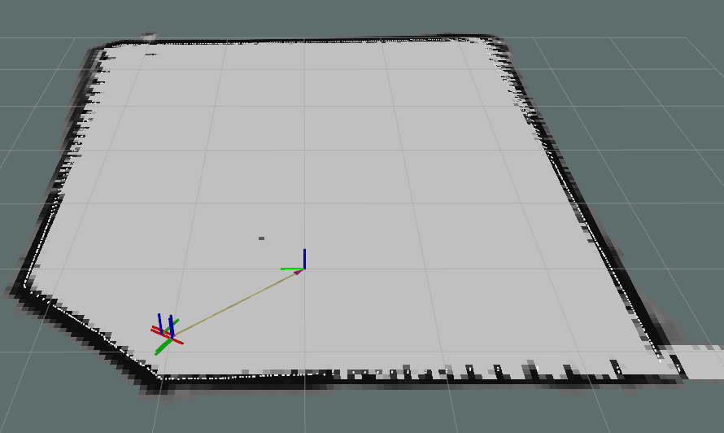

# SLAM & Localization Architecture

This project goes beyond simply applying a SLAM algorithm and instead builds a dedicated **sensor data pre-processing** and **state estimation** pipeline to ensure seamless integration with the autonomous vehicle control system.

---

## 1. SLAM & Localization Architecture

### 1.1 Visual Verification (Rviz Visualization)

<p align="center">
  
</p>

#### Coordinate Reference (0,0)

<p align="center">
  
</p>

The global position of the vehicle is estimated in real time with respect to the origin (0, 0) of the `map` frame.

#### TF Connectivity

<p align="center">
  
</p>

<p align="center">
  
</p>

The `map` frame published by Cartographer and the vehicle’s `base_link` are coherently connected through the TF tree.

#### Lidar & Map Alignment

<p align="center">
  
</p>

Real-time LiDAR scan data is accurately matched with the generated map, enabling precise localization.

---

### 1.2 Tech Detail: Sensor Synchronization & Setup

For successful SLAM operation, accurate **time synchronization** between sensors and **rigorous sensor pose definition** are critical.  
To reinforce the hardware abstraction layer, a `fixed_lidar_frame` node was introduced.

#### Timestamp Synchronization (Time Sync)

Due to the heterogeneous nature of LiDAR and IMU sensors, time offsets between sensor streams are a major cause of localization failure, especially during high-speed driving.

To address this issue, a `SyncFrameBroadcaster` was implemented to forcibly synchronize the LiDAR timestamp with the IMU timestamp (`last_imu_header_`).  
This design ensures that Cartographer fuses sensor data without temporal inconsistency.

#### Rigorous TF Definition

The LiDAR hardware is mounted 0.1 m forward along the X-axis from the vehicle center (`base_link`) and rotated by 180 degrees (3.14 rad) around the Z-axis.  
These constraints are rigorously defined using `tf2_ros::TransformBroadcaster`.

<p align="center">
  
</p>

---

### 1.3 Algorithm Selection: Google Cartographer

Rather than implementing a full SLAM system from scratch, the well-validated open-source solution **Cartographer** was adopted and optimized for the QCar environment.

| Solution | Type | Decision | Reason |
|--------|------|----------|--------|
| AMCL | Map-based Localization | X | Requires a predefined map and cannot handle unknown environments |
| Cartographer | Graph-based SLAM | O | Tight LiDAR–IMU coupling enables simultaneous mapping and localization |

#### Optimization Strategy (Lua Configuration)

Online correlative scan matching was enabled to compensate for cumulative wheel odometry error.

The loop-closure minimum score was set to 0.65 to prevent incorrect scan matching from corrupting the map.

---

### 1.4 Post-Processing: Stable Control Interface

A custom `LocationNode` was developed to convert SLAM-derived TF pose information into a control-friendly format (`geometry_msgs::Point`).

#### Coordinate System Unification (Map to Control Frame)

A 90-degree rotational mismatch exists between the ENU-based SLAM coordinate system and the vehicle control coordinate system.

Raw coordinates obtained via the TF listener are transformed to align with the vehicle’s driving direction using the following mapping:

```
x = -(y_raw)
y = x_raw
```

#### Signal Quantization (Noise Suppression)

Due to the nature of LiDAR SLAM, small positional noise persists even during low-speed driving or when the vehicle is stationary.  
When directly fed into the steering controller, this noise caused oscillatory steering behavior.

Instead of applying computationally expensive filters such as Kalman or Particle filters, a quantization strategy was adopted to limit resolution to a control-relevant scale.

The following quantization logic is applied:

```cpp
float filtered_val = floor(raw_val * 10) / 10;
```

Using this formulation, position data is truncated to 0.1 m resolution, and heading (yaw) is truncated to 0.1 rad resolution.

This intuitive filtering approach minimizes computational cost while eliminating insignificant noise, enabling smooth and stable vehicle control.
