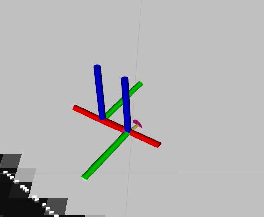
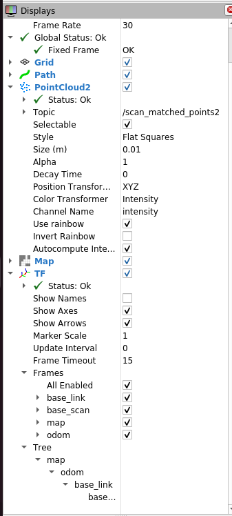
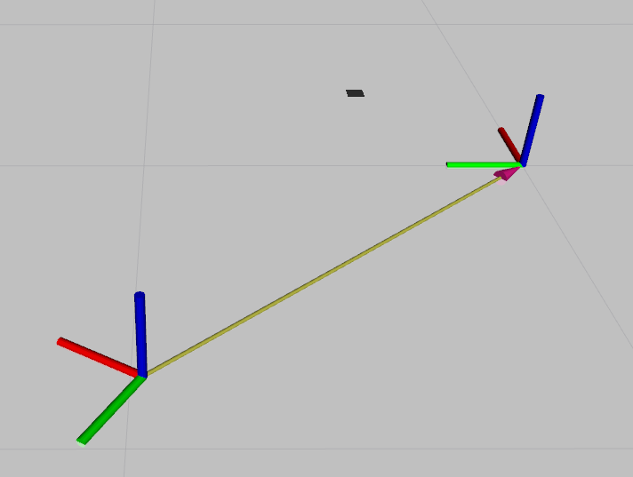

# SLAM & Localization Architecture

본 프로젝트는 단순히 SLAM 알고리즘을 사용하는 것을 넘어, 자율주행 차량의 제어 시스템과 완벽하게 연동하기 위한 **센서 데이터 전처리(Pre-processing)** 및 **상태 추정(State Estimation)** 파이프라인을 자체 구축했습니다. 

---

## 1. SLAM & Localization Architecture

### 1.1 Visual Verification (Rviz Visualization)
<p align="center">
  
</p>
**1. Coordinate Reference (0,0)**
<p align="center">
  
</p>
*  map 프레임의 원점(0, 0)을 기준으로 차량의 전역 좌표가 실시간으로 추정되는 모습입니다.

**2. TF Connectivity**
<p align="center">
  
</p>
*  Cartographer가 발행하는 `map` 좌표계와 차량의 `base_link`가 TF 트리를 통해 유기적으로 연결되어 있음을 검증했습니다.

**3. Lidar & Map Alignment**
<p align="center">
  
</p>
*  실시간 라이다 스캔 데이터와 생성된 지도가 오차 없이 정합(Matching)되어, 정밀한 위치 추정(Localization)이 수행되고 있음을 보여줍니다.

---

### 1.2 Tech Detail: Sensor Synchronization & Setup

성공적인 SLAM을 위해 가장 중요한 것은 센서 데이터의 **시간 동기화**와 **정확한 센서 위치 정의**입니다. 우리는 `fixed_lidar_frame` 노드를 통해 하드웨어 추상화 계층을 강화했습니다.

#### 1.2.1 Timestamp Synchronization (Time Sync)
* **Problem**: 이기종 센서(LiDAR, IMU) 간의 데이터 수신 시간 차이(Time Offset)는 고속 주행 시 위치 추정 실패(Map Drift)의 주원인입니다.
* **Solution**: `SyncFrameBroadcaster`를 구현하여 LiDAR 데이터의 타임스탬프를 IMU의 타임스탬프(`last_imu_header_`)에 **강제 동기화**했습니다. 이를 통해 Cartographer가 데이터를 처리할 때 시간 축의 오차 없이 두 센서 데이터를 융합할 수 있도록 설계했습니다.

#### 1.2.2 Rigorous TF Definition
* **Implementation**: LiDAR가 차량의 중심(`base_link`)으로부터 X축으로 0.1m 전진 배치되어 있고, Z축 기준 180도(3.14 rad) 회전되어 장착된 하드웨어 구속 조건을 `tf2_ros::TransformBroadcaster`를 통해 엄밀하게 정의했습니다.

---

### 1.3 Algorithm Selection: Google Cartographer

완전한 SLAM 시스템을 바닥부터 구현하는 대신, 검증된 오픈소스 솔루션인 **Cartographer**를 채택하고 **QCar 환경에 맞게 파라미터를 최적화**했습니다.

| Solution | Type | Decision | Reasoning |
| :--- | :--- | :---: | :--- |
| **AMCL** | Map-based Localization | X | 사전에 완벽한 지도가 있어야 하며, 미지의 환경 대응 불가 |
| **Cartographer** | Graph-based SLAM | **O** | **LiDAR와 IMU 데이터를 긴밀하게 결합**하여 실시간 매핑과 위치 추정을 동시에 수행 가능 |

#### Optimization Strategy (Lua Configuration)
* **Online Correlative Scan Matching**: 휠 오도메트리(Wheel Encoder)의 누적 오차를 보정하기 위해, 실시간 스캔 매칭(`use_online_correlative_scan_matching = true`)을 활성화하여 위치 정밀도를 높였습니다.
* **Constraint Builder**: 루프 클로저의 최소 점수를 0.65(`min_score = 0.65`)로 설정하여, 잘못된 매칭으로 인한 지도 깨짐 현상을 방지했습니다.

---

### 1.4 Post-Processing: Stable Control Interface

SLAM을 통해 얻은 위치 정보(`tf`)를 제어 알고리즘이 사용할 수 있는 형태(`geometry_msgs::Point`)로 변환하고 안정화하는 `LocationNode`를 자체 개발했습니다.

#### 1.4.1 Coordinate System Unification (Map to Control Frame)
* **Analysis**: SLAM에서 사용하는 지도 좌표계(ENU)와 차량 제어기에서 사용하는 좌표계 간의 90도 회전 불일치가 존재했습니다.
* **Solution**: TF 리스너를 통해 얻은 Raw 좌표를 차량의 진행 방향에 맞게 변환 행렬(Matrix Transformation)을 적용했습니다.
* **Implementation**: `x = -(y_raw)`, `y = x_raw` 로직을 적용하여 SLAM 좌표를 제어 좌표로 매핑했습니다.

#### 1.4.2 Signal Quantization (Noise Suppression)
* **Issue**: LiDAR SLAM 특성상 정지 상태나 저속 주행 시에도 수 mm 단위의 미세한 위치 노이즈가 발생합니다. 이 고주파 노이즈가 조향 제어기로 그대로 전달되어 조향이 흔들리는 현상이 발생했습니다.
* **Robust Approach**: 복잡한 필터(Kalman/Particle) 대신, 제어에 유의미한 수준으로 해상도를 제한하는 **양자화(Quantization)** 기법을 적용했습니다.
* **Algorithm**:
    ```cpp
    // Quantization Logic
    float filtered_val = floor(raw_val * 10) / 10;
    ```
    위 수식을 통해 위치 데이터를 **0.1m 단위**로, 헤딩(Yaw)을 **0.1 rad 단위**로 절삭(Truncation)했습니다.
* **Result**: 이 직관적인 필터링을 통해 연산 부하(Computational Cost)를 최소화하면서도, 제어기가 반응할 필요 없는 미세 노이즈를 원천 차단하여 **부드럽고 안정적인 주행**을 달성했습니다.
