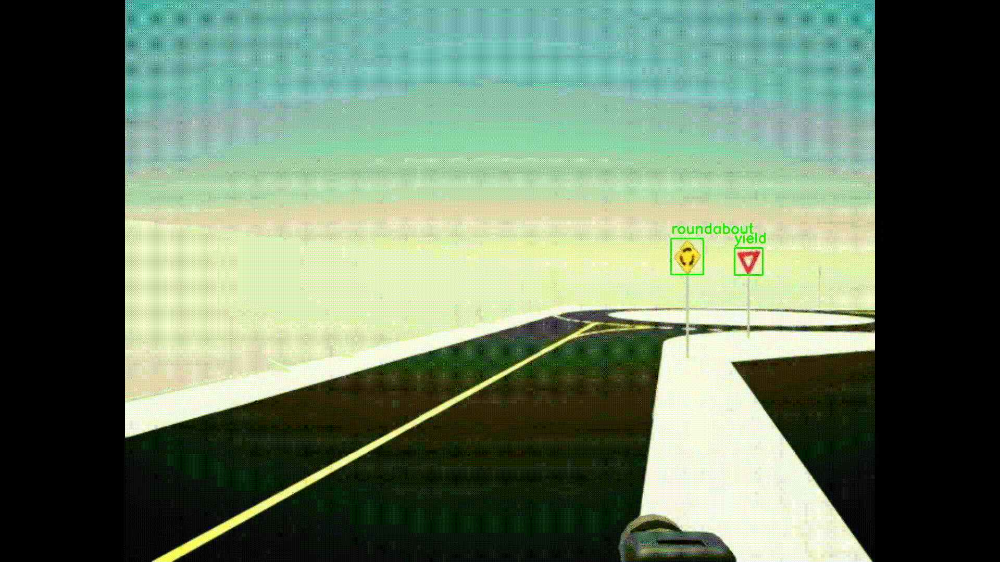
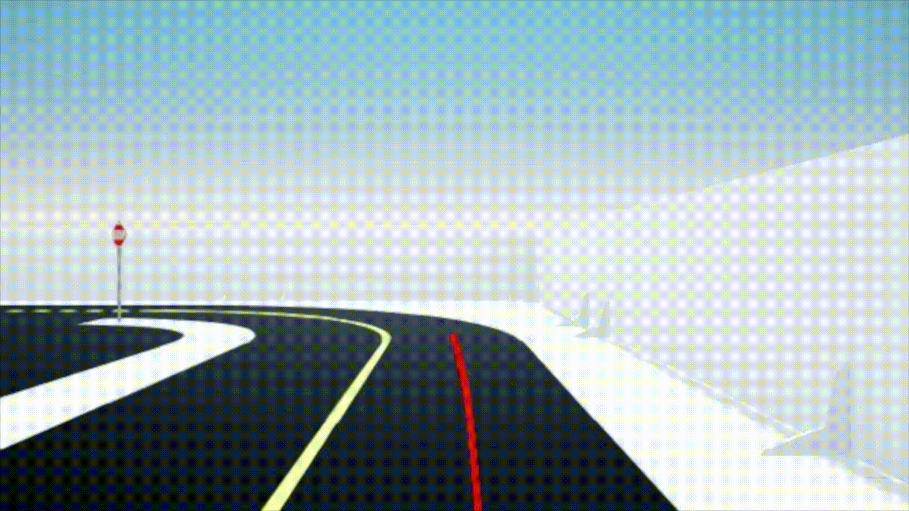
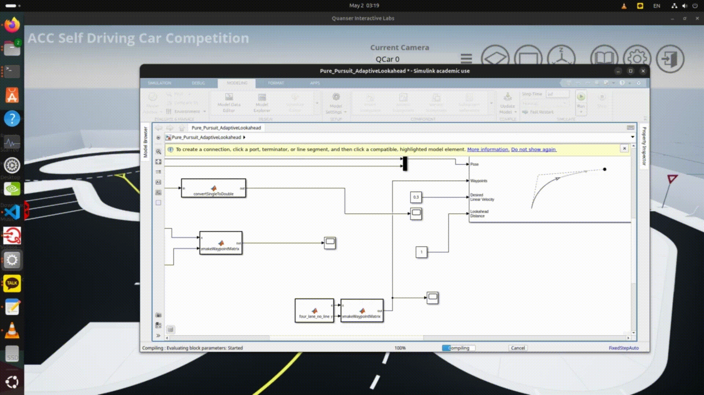
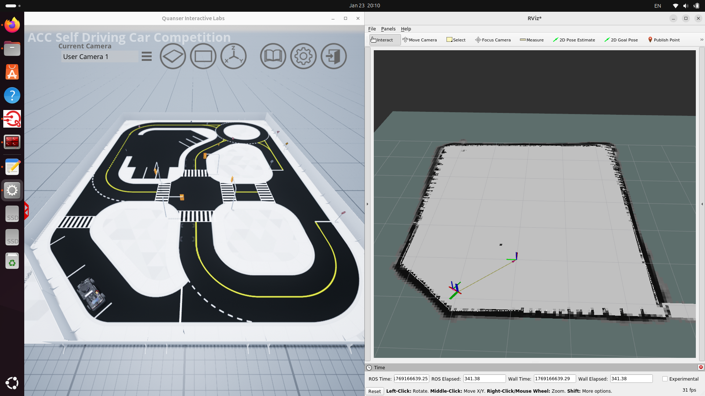
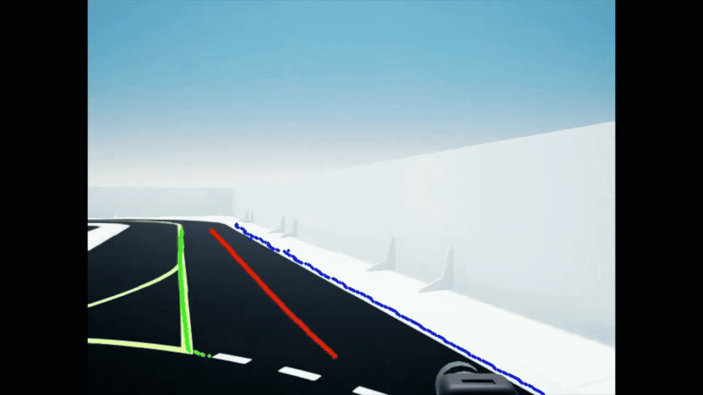
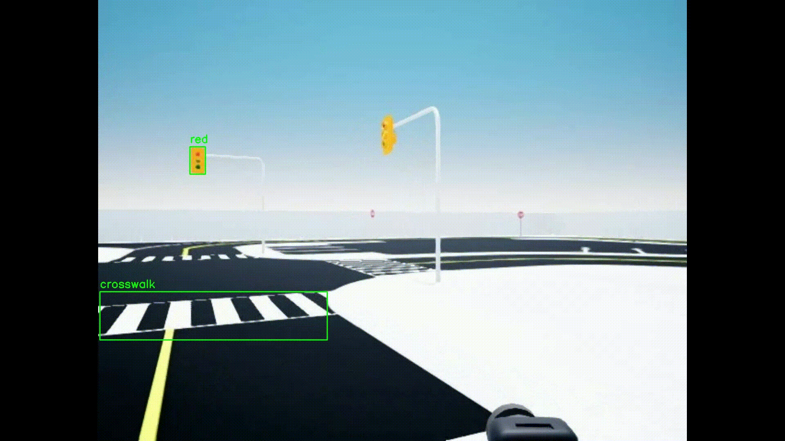

# KDAS2026


<div align="center">
  
</div>


## Introduction

본 프로젝트는 국민대학교 K-DAS팀이 **American Control Conference(ACC) Self-Driving Car Student Competition 2026** Virtual Stage 제출을 목표로 개발된 자율주행 시스템의 소스 코드를 정리한 레포지토리입니다.

본 저장소에는 ACC Virtual Stage 시연 영상에서 사용된 자율주행 알고리즘의 구현 코드와 함께, 각 자율주행 모듈의 설계 의도, 구현 방식,  그리고 ACC Core Principles에 기반한 시스템 구성에 대한 설명이 포함되어 있습니다.

또한 전체 시스템의 실행 방법과 각 모듈 간 연동 구조를 확인할 수 있도록 구성되어 있습니다.


---


## System Evolution and Objectives

본 팀은 Self-Driving Car Student Competition 2025에서 Virtual Stage 평가를 통과하여 Physical Stage에 진출한 경험이 있다.

본선 주행 과정에서 **주행 안정성**과 **속도 측면에서의 한계**를 확인하였으며, 이러한 문제점을 2026 시즌 시스템 설계의 주요 개선 사항으로 설정하였다.

이에 주행 안정성을 향상시키기 위한 제어 구조 개선과, 보다 적극적인 속도 계획이 가능하도록  
의사결정 및 경로 계획 로직을 고도화함으로써 기존 자율주행 시스템을 발전시켰다.

이러한 개선을 통해 저희 팀은 **2026 ACC Self-Driving Car Student Competition에서의 의미 있는 성과**를  
목표로 한다.


---


## Whole Project

본 자율주행 시스템은 실제 자율주행 차량의 시스템 구조를 기준으로  
인지(Perception), 위치추정(Localization), 판단·계획(Decision & Planning), 제어(Control)  
단계로 구성된 계층적 구조를 따른다.

- 인지 모듈은 주행 환경으로부터 필요한 정보를 추출하고  
- 위치추정 모듈은 차량의 현재 위치와 자세를 안정적으로 추정하며  
- 판단·계획 모듈은 해당 정보를 바탕으로 주행 전략과 경로를 결정하고  
- 제어 모듈은 결정된 경로를 따라 차량이 실제로 주행할 수 있도록 조향·제동 명령을 생성합니다.

아래 GIF들은 각 모듈에서 실제로 구현한 기능과 그 결과를 요약적으로 보여줍니다.  
각 항목의 링크를 클릭하면, 해당 모듈의 상세 문서와 구현 결과를 확인할 수 있습니다.

<table>
  <tr>
    <td align="center">
      <br>
      <b>YOLO – 객체 인식 (1)</b><br>
      <a href="Perception/YOLO/">폴더 바로가기</a>
    </td>
    <td align="center">
      <br>
      <b>YOLO – 객체 인식 (2)</b><br>
      <a href="Perception/YOLO/">폴더 바로가기</a>
    </td>
  </tr>
  <tr>
    <td align="center">
      <br>
      <b>SCNN – 차선 인식</b><br>
      <a href="Perception/SCNN/">폴더 바로가기</a>
    </td>
    <td align="center">
      <br>
      <b>Control – 조향 및 제동 제어</b><br>
      <a href="Control/">폴더 바로가기</a>
    </td>
  </tr>
</table>

---

## Project Modules Overview

아래는 본 자율주행 시스템을 구성하는 주요 모듈과, 각 모듈이 전체 자율주행 파이프라인 내에서 수행하는 역할을  
구현 관점에서 정리한 내용이다.

본 시스템은 ACC Self-Driving Car Student Competition에서 제시하는 자율주행 핵심 원칙  
(Data Collection, Localization, Decision & Planning, Control)을  각 모듈 단위의 실제 구현으로 구성하였다.

모듈은 실제 데이터 흐름  
(Perception → Localization → Planning → Control)을 기준으로 정렬되어 있으며,  

각 항목의 제목을 통해 해당 모듈의 상세 문서와 구현 내용을 확인할 수 있다.

---

### Core Principles Mapping

| ACC Core Principle | Implemented Modules |
|---|---|
| Data Collection | SCNN (Lane Detection), YOLO (Object Detection), LiDAR (Cartographer) |
| Interpretation & Decision Making | Decision & Planning (DQN-based decision) |
| Localization & Path Planning | Localization (Cartographer SLAM), Decision & Planning (Path generation) |
| Control Systems | Control (Pure Pursuit, Obstacle Avoidance), MATLAB/Simulink interface |

---

### [1) Localization](Localization/Cartographer/)


<p align="center">
  
</p

**Core Principle**: Localization & Path Planning  

**역할**  
Localization 모듈은 차량의 현재 위치와 자세를 추정하여,  
자율주행 시스템 전반에서 공통으로 사용되는 **기준 좌표계 및 위치 정보**를 제공합니다.

Planning 및 Control 모듈은 모두 Localization 결과를 기반으로 동작하며,  
경로 추종, 장애물 회피 등 모든 주행 제어 동작은  
해당 위치 추정 결과를 기준으로 수행됩니다.

**구현 개요**  
- LiDAR 센서를 활용한 2D SLAM 기반 위치 추정  
- Cartographer를 이용한 지도 생성 및 위치 추정 파이프라인 구성  
- ROS2 TF 트리를 통한 좌표계 관리  

---

### [2) Decision & Planning](Planning/)

<p align="center">
  
</p
  
  <p align="center">
  
</p

**Core Principle**: Interpretation & Decision Making, Localization & Path Planning  

**역할**  
Decision & Planning 모듈은 인지 및 위치추정 결과를 입력으로 받아,  
차량이 현재 주행 상황에서 어떤 행동을 수행해야 하는지를 결정하고  
그에 따른 주행 경로를 생성하는 역할을 담당합니다.

본 시스템에서는 주행 환경 해석 결과와 차량 상태 정보를 바탕으로  
DQN 기반 의사결정 로직을 통해 주행 전략을 선택하며,  
선택된 전략에 따라 waypoint 기반 경로를 생성하여  
제어 단계로 전달합니다.

**구현 개요**
- 차선 인식 및 객체 인식 결과를 입력으로 주행 상황 해석  
- DQN 기반 의사결정 로직을 통한 주행 전략 선택  
- 선택된 전략에 따른 waypoint 기반 경로 생성  

---

### [3) Control](Control/)

**Core Principle**: Control Systems  

**역할**  
Control 모듈은 Planning 단계에서 생성된 주행 경로와  
Localization을 통해 추정된 차량 상태를 입력으로 받아,  
차량이 실제로 주행할 수 있도록 **조향 및 제동 명령을 생성하는 최종 제어 단계**입니다.

본 시스템의 Control 모듈은  
정상 주행과 장애물 대응 상황을 구분하여 동작하도록 구성되어 있습니다.

---

#### [3-1) Pure Pursuit Control](Control/Matlab&Simulink/Pure%20Pursuit/)

<table>
  <tr>
    <td align="center">
      <br/>
      <b>Pure Pursuit Steering Control Result</b>
    </td>
  </tr>
  <tr>
    <td align="center">
      <br/>
      <b>Simulink-Based Steering Control Structure</b>
    </td>
  </tr>
</table>

**역할**  
Pure Pursuit 모듈은 장애물이 없는 정상 주행 상황에서,  
Planning 단계에서 전달된 waypoint 경로와  
Localization 모듈로부터 전달받은 차량의 현재 위치 및 자세 정보를 기반으로  
차량이 안정적으로 주행하도록 조향각을 계산하는 경로 추종 제어 모듈입니다.

**구현 개요**  
- Look-Ahead Distance 기반 목표점 추종 방식 적용  
- 차량의 현재 위치와 목표점 간의 기하학적 관계를 이용한 조향각 계산  
- Simulink 기반 제어기 설계 및 ROS2 노드 형태로 연동  

---

#### [3-2) Obstacle Avoidance Control](Control/Obstacle%20Avoidance/)

**역할**  
Obstacle Avoidance 모듈은 주행 경로 상에 장애물이 존재하는 경우,  
Localization 결과를 통해 파악된 차량 위치와  
센서를 통해 인식된 장애물의 위치, 크기, 그리고 차량과 장애물 간의 상대 거리를 고려하여  
충돌을 방지하기 위한 횡방향 회피 기동과 차선 복귀 동작을 수행하는 제어 모듈입니다.

**구현 개요**  
- 전방 장애물과의 거리 조건을 기반으로 회피 기동 필요 여부 판단  
- LiDAR 또는 Depth Camera를 이용한 장애물 위치 및 크기 추정  
- 차량 폭과 안전 여유 거리를 고려한 최소 횡방향 회피 거리 계산  
- 기존 waypoint를 기반으로 한 국소적 경로 수정 방식 적용  
- 일정 곡률을 이용한 회피 기동 수행 및 동일 곡률 기반 차선 복귀  

---

### [4) SCNN – Lane Detection](Perception/SCNN/)



**Core Principle**: Data Collection  

**역할**  
SCNN 모듈은 카메라 입력 영상을 기반으로 차선을 인식하고,  
차량이 추종할 수 있는 **차선 구조 및 기준선 정보**를 생성하는 인지 모듈입니다.

차선 인식 결과는 주행 가능 영역 추론 및 경로 생성에 활용되며,  
Planning 단계와 제어 단계의 경로 추종을 지원합니다.

**구현 개요**  
- SCNN 모델 기반 차선 인식 파이프라인 구성  
- 입력 영상 전처리 및 출력 후처리 설계  
- ROS2 메시지 형태로 차선 정보 전달  

---

### [5) YOLO – Object Detection](Perception/YOLO/)

<table>
  <tr>
    <td align="center"><br/><b>Video (Sim) #1</b></td>
    <td align="center"><br/><b>Video (Sim) #2</b></td>
  </tr>
</table>

**Core Principle**: Data Collection  

**역할**  
YOLO 모듈은 카메라 영상을 입력으로 받아  
교통 표지판 및 신호와 같은 객체를 실시간으로 인식하는 인지 모듈입니다.

인식된 객체 정보는 주행 상황 해석 및 의사결정에 활용되며,  
Planning 및 Control 단계에서의 행동 선택에 필요한 입력으로 사용됩니다.

**구현 개요**  
- YOLO 기반 객체 인식 모델 적용  
- 실시간 추론 결과를 ROS2 토픽으로 송신  
- 제어 로직과 연동 가능한 인터페이스 설계  

---

## Repository Scope

This repository contains a fully integrated autonomous driving system  
including perception, localization, decision making, planning, and control modules.  
All components are designed to operate together within a ROS2-based framework.

---

## Virtual Stage Execution Guide (Docker + ROS2)

This section describes how to run the full autonomous driving system  
in the **Quanser Virtual QCar2 (QLabs) simulation environment** using Docker and ROS2.

The procedure below reproduces the complete pipeline:  
**Perception – Localization – Planning – Control**.

---

## System Overview

This demo uses **two Docker containers**:

- **Shell A — QLabs Simulation Container**
  - Spawns the Virtual QCar2 vehicle, sensors, map, and scenario
  - Must be started **before** the ROS2 containers

- **Shell B–I — Development Container (ROS2)**
  - Runs all ROS2 nodes:
    - Perception
    - Localization
    - Planning
    - Control
      
---

## Shell A — QLabs Virtual QCar2 Simulation

### 1) Run QLabs Simulation Container

```bash
cd /home/$USER/Documents/ACC_Development/docker/development_docker/quanser_dev_docker_files

sudo docker run --rm -it \
  --network host \
  --name virtual-qcar2 \
  quanser/virtual-qcar2 bash
```

---

### 2) Initialize Scenario (Inside Container)

```bash
cd /home/qcar2_scripts/python
python3 Base_Scenarios_Python/Setup_Real_Scenario.py
```

This script performs:
- Virtual QCar2 vehicle spawning
- Sensor and environment initialization
- Driving scenario setup

---

## Shell B–I — Development Container (ROS2)

### 1) Start Development Container

Open multiple terminals (Shell B–I).  
In **each terminal**, execute:

```bash
cd /home/$USER/Documents/ACC_Development/isaac_ros_common
./scripts/run_dev.sh /home/$USER/Documents/ACC_Development/Development

cd ros2
```

---

### 2) Build (Run Once Only)

In **one terminal only**:

```bash
colcon build
```

---

### 3) Source Environment (Every Terminal)

After the build, run in **all Shells (B–I)**:

```bash
source install/setup.bash
```

---

## ROS2 Launch Sequence (Recommended Order)

### Shell B — Base Virtual QCar2 Nodes

```bash
ros2 launch qcar2_nodes qcar2_virtual_launch.py
```

---

### Shell C — Localization (Cartographer)

```bash
ros2 launch qcar2_nodes localization0_launch.py
```

> **Wait until Cartographer localization is stable before proceeding.**

---

### Shell D — Utility Nodes

```bash
ros2 launch util util_launch.py
```

---

### Shell E — Path Planning

```bash
ros2 launch path_planning path_planning_launch.py
```

---

### Shell F — Control (MATLAB / Simulink Interface)

```bash
ros2 launch kdas_mat kdas_mat.launch.py
```

---

### Shell H — Object Detection (YOLO)

```bash
ros2 run yolo_detection yolo_node.py
```

---

### Shell I — Lane Detection

```bash
ros2 launch lane_detection lane_detection_launch.py
```

---

## Start Autonomous Driving (Run Last)

### Shell G — Enable Autonomous Ride

After **all nodes are running** and  
**Cartographer localization is confirmed**, execute:

```bash
ros2 topic pub /ride std_msgs/msg/Char "{data: 86}"
```

This command enables autonomous driving.

---

## Operational Notes

If the vehicle does not start moving, verify the following:

- All required nodes are running (Shell B–F, H–I)
- Cartographer localization is stable and not drifting
- Required ROS2 topics are properly published and subscribed
